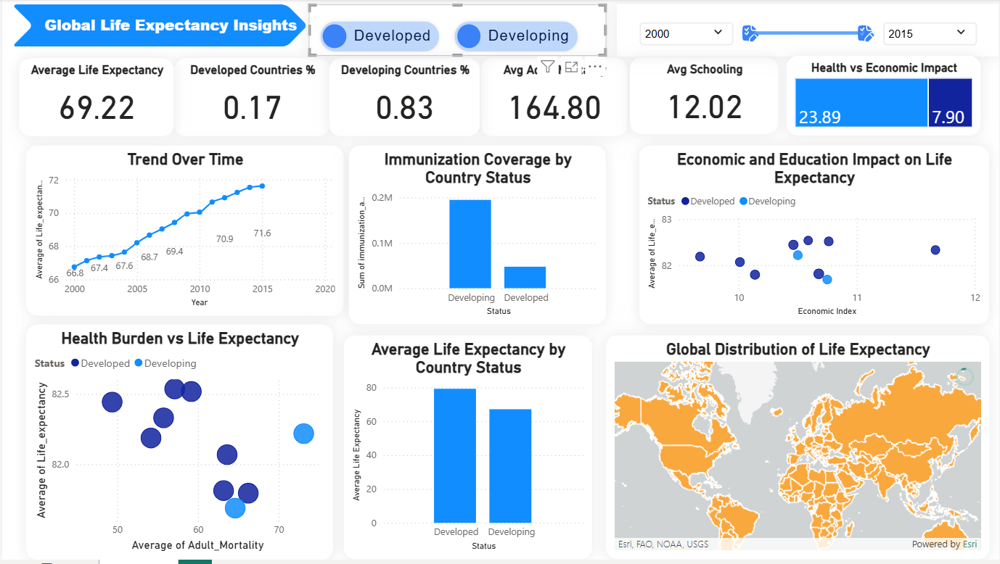

# Global Life Expectancy Analysis & Prediction

## Project Overview

A comprehensive data science initiative to analyze factors influencing global life expectancy and build predictive models using WHO/UN data from 2000-2015. The project delivers both analytical insights through a Power BI dashboard and a production-ready machine learning pipeline for accurate life expectancy prediction.

## Dashboard & Visual Analytics

## Global Life Expectancy Overview




**Key Metrics:**
- Global Average Life Expectancy: 69.22 years
- Country Distribution: 17% Developed, 83% Developing
- Average Adult Mortality: 164.80 deaths per 1000 adults
- Average Schooling: 12.02 years

### Developing Countries Analysis


**Developing Countries Specifics:**
- Average Life Expectancy: 67.11 years
- Average Schooling: 11.27 years
- Shows clear upward trend from 65.2 years (2000) to 69.7 years (2015)

### Dashboard Insights:
- **Trend Analysis**: Steady global improvement from ≈67 years (2000) to ≈71 years (2015)
- **Geographic Distribution**: Higher life expectancy in Europe, North America, Australia; lower in Sub-Saharan Africa, South Asia
- **Health Burden Correlation**: Strong negative relationship between adult mortality and life expectancy
- **Economic Impact**: Positive correlation between economic indicators and life expectancy
- **Immunization Coverage**: Higher total volumes in developing countries due to larger populations and health initiatives

## Data Pipeline

### Source Data
- **Dataset**: WHO and United Nations data from Kaggle
- **Period**: 2000-2015
- **Scope**: 193 countries, 2938 observations, 22 features
- **Target Variable**: Life expectancy (years)

### Data Cleaning Process
1. **Column Standardization**: Removed leading/trailing spaces from column names
2. **Missing Value Treatment**:
   - Group-wise median imputation (by Status) for features with dependency
   - Global median imputation for moderately missing features
   - Row deletion for missing target-related values
3. **Skewness Correction**: Logarithmic transformation (log(1+x)) applied to highly skewed features (GDP, Population, Measles, Infant deaths, HIV/AIDS)

### Feature Engineering
Engineered five domain-informed features:
- **Child Mortality Rate**: Combines infant deaths and under-five deaths
- **Immunization Average**: Average coverage of Hepatitis B, Polio, and Diphtheria
- **Economic Strength**: Combines GDP and income composition
- **Education Index**: Combines schooling and income composition
- **Mortality Pressure**: Combines adult mortality and HIV/AIDS prevalence

### Preprocessing Pipeline
1. **Categorical Encoding**: Binary encoding for Status (Developed=1, Developing=0)
2. **Train/Test Split**: 80/20 split before scaling to prevent data leakage
3. **Feature Scaling**: StandardScaler fitted on training data only
4. **Data Export**: Final preprocessed arrays saved as X_train, X_test, y_train, y_test

## Machine Learning Models

### Baseline Model: Linear Regression
**Performance:**
- Training: MAE=2.67, RMSE=3.54, R²=0.864
- Testing: MAE=2.71, RMSE=3.54, R²=0.855

### Advanced Model: Random Forest Regressor
**Initial Configuration:** n_estimators=200, random_state=42
**Performance:**
- Training: MAE=0.43, RMSE=0.69, R²=0.995
- Testing: MAE=1.07, RMSE=1.70, R²=0.966

### Hyperparameter Optimization
Used RandomizedSearchCV with 30 iterations and 5-fold cross-validation:
- **Search Space**: max_depth, max_features, min_samples_leaf, min_samples_split, n_estimators
- **Optimal Parameters**: max_depth=20, max_features='sqrt', n_estimators=400
- **Optimized Performance**: MAE=1.05, RMSE=1.65, R²=0.969

### Final Model Comparison
| Model | MAE (Test) | RMSE (Test) | R² (Test) |
|-------|------------|-------------|-----------|
| Linear Regression | 2.706 years | 3.542 years | 0.855 |
| Random Forest | 1.065 years | 1.703 years | 0.966 |
| **Optimized Random Forest** | **1.053 years** | **1.647 years** | **0.969** |

## Key Analytical Findings

### Global Patterns
1. **Development Status Impact**: Strongest determinant of life expectancy due to healthcare infrastructure, education, and economic stability
2. **Health Burden**: Higher adult mortality directly reduces life expectancy, especially in developing regions
3. **Economic & Education Synergy**: Economic growth alone insufficient; education amplifies positive impact on health outcomes
4. **Immunization**: Coverage widespread but quality and consistency vary, affecting long-term gains

### Regional Disparities
- **Developed Countries**: Higher life expectancy, better healthcare systems
- **Developing Countries**: Lower life expectancy, higher mortality, but showing steady improvement
- **Geographic Clusters**: Clear patterns based on economic strength, health systems, and disease burden

## Project Structure

```
CAT-RELOADED-LIFE-EXPECTANCY/
├── data/
│   ├── raw/Life_Expectancy_Data.csv          # Original dataset
│   ├── processed/life_expectancy_clean.csv    # Cleaned dataset
│   └── processed/life_expectancy_dashboard.csv # Dashboard dataset
├── notebooks/                                 # Analysis pipeline
│   ├── 01_data_understanding.ipynb           # Initial exploration
│   ├── 02_data_cleaning.ipynb                # Data cleaning steps
│   ├── 03_preprocessing.ipynb                # Feature engineering & prep
│   └── 04_modeling.ipynb                     # Model training & evaluation
├── EDA using Power BI/                        # Dashboard assets
│   ├── developed_countries_health_gap.png
│   ├── developing_countries_health_gap.png
│   ├── overview_global_life_expectancy.png
│   └── Life_expectancy_Dashboard.pbix        # Power BI file
├── Models/                                    # Trained models
│   ├── Linear_Regression_model.pkl
│   └── random_forest_best_model.pkl
├── src/                                       # Source modules
│   ├── data_loader.py                        # Data loading utilities
│   ├── preprocessing.py                      # Preprocessing functions
│   └── plot_style.py                         # Visualization styling
├── submission/                                # Final documentation
│   ├── Global Life Expectancy Insights.pdf   # Executive summary
│   ├── Life Expectancy Report.pdf            # Technical report
│   ├── SQL_solution.pdf
│   └── theoretical_questions.pdf
├── .gitignore
├── README.md
└── requirements.txt                          # Dependencies
```

## Setup & Execution

### Prerequisites
```bash
pip install -r requirements.txt
```

### Run Analysis Pipeline
Execute notebooks in sequence:
```bash
jupyter notebook notebooks/01_data_understanding.ipynb
# Continue through 02, 03, 04
```

### Load and Use Trained Models
```python
import pickle
with open('Models/random_forest_best_model.pkl', 'rb') as f:
    model = pickle.load(f)
predictions = model.predict(X_test)
```

### Access Dashboard
Open `EDA using Power BI/Life_expectancy_Dashboard.pbix` in Power BI Desktop for interactive exploration.

## Technical Implementation Details

### Data Processing Features
- Handles real-world data issues: missing values, skewness, categorical variables
- Preserves data integrity while minimizing bias
- Creates interpretable, domain-aligned features

### Modeling Strengths
- Dual modeling approach validates linear and non-linear relationships
- Comprehensive hyperparameter tuning ensures optimal performance
- Prevents data leakage through proper train/test separation
- Maintains reproducibility through random state control

### Visualization Capabilities
- Power BI dashboard provides stakeholder-friendly interface
- Multiple chart types reveal different aspects of the data
- Geographic mapping shows regional patterns
- Time series analysis tracks progress over 15 years

## Business & Policy Implications

### For Policymakers
1. **Targeted Interventions**: Focus on reducing adult mortality in developing regions
2. **Integrated Approach**: Combine economic development with education investments
3. **Healthcare Infrastructure**: Strengthen systems in low-performing regions
4. **Monitoring Framework**: Use predictive models to track progress and identify at-risk populations

### For Health Organizations
1. **Resource Allocation**: Data-driven prioritization of immunization and healthcare programs
2. **Outcome Prediction**: Model can forecast life expectancy impacts of interventions
3. **Regional Strategy**: Customized approaches based on specific country profiles

## Conclusion

This project delivers a complete analytical solution for understanding and predicting global life expectancy. The combination of visual dashboard analytics and accurate machine learning models provides both immediate insights and predictive capabilities. The optimized Random Forest model achieves high accuracy (R²=0.969) while maintaining interpretability through domain-informed feature engineering.

The solution is production-ready, with clean code structure, proper documentation, and both analytical and predictive components suitable for decision support in global health policy and planning.